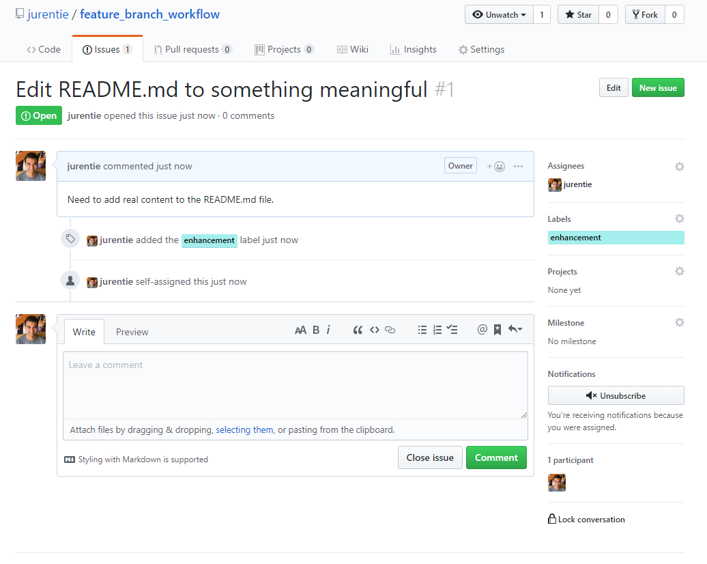
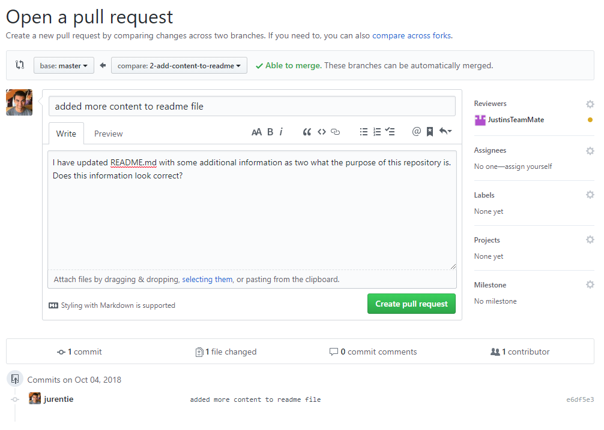
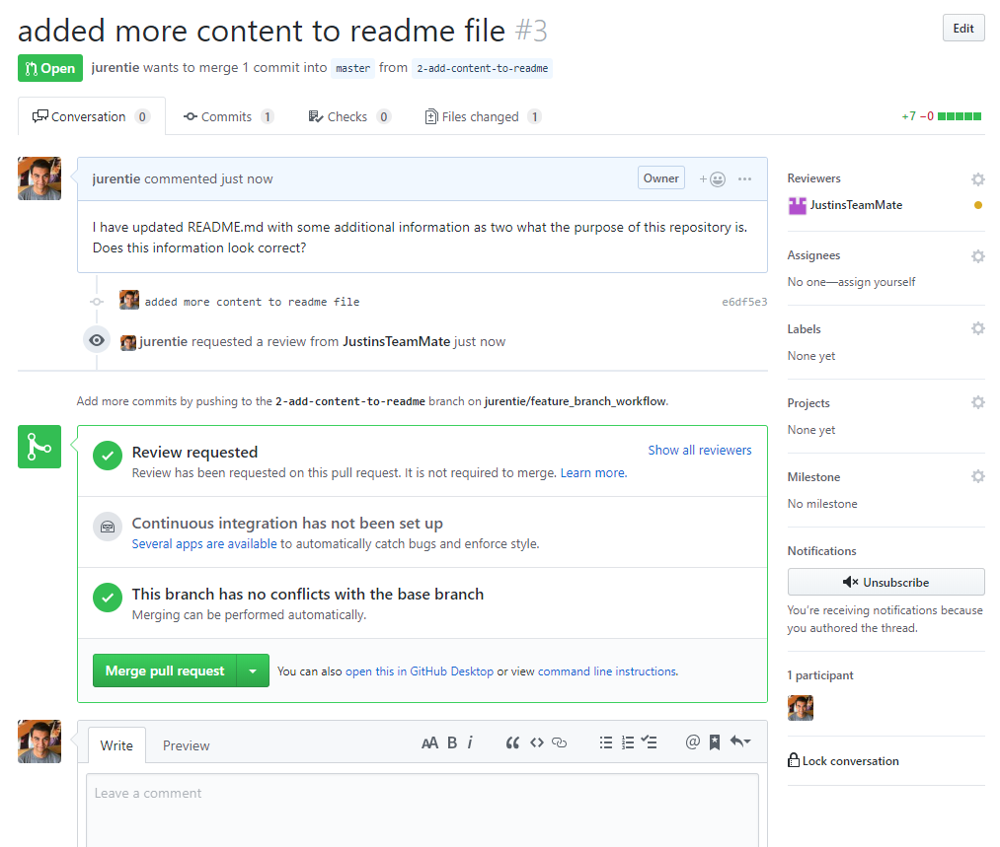

# Git Workflow

* [Feature Branch Workflow](#feature-branch)
* [Pull Requests](#pull-requests)
* [Fast-Forward](#fast-forward)

## Feature Branch

This approach is used by Open Water Foundation when a single developer is primarily
working on any given project. In this case there may be a couple contributors with
write permission to the repository, but one developer is doing most of the work.

When using the feature branch workflow it is easy to keep track of exactly what code
is being added or removed from the overall project. These edits are made in small,
concise, feature branches.

All development that takes place is done in feature branches and never in master.
This way master will never have any broken code.

#### How it works: ####

A feature branch workflow is intended to keep development from being done directly
on the master branch, so each edit done to the code happens in it's own separate branch.

1. Best practice is to first create an issue on GitHub that describes what feature is
being added to the code.


2. Before making the new branch, ensure that you are currently on the `master` branch
and that `master` is up to date with any recent changes.
```
$ git checkout master
$ git pull
```

3. You can now create a feature branch from the `master` branch (sometimes referred
to as a "topic" branch), using the issue number and label:  
`checkout` switches to a new branch, `-b` creates
the new branch to switch to, if the given branch name does not already exist.
```
$ git checkout -b 1-update-readme
```

<p align="center">
 
</p>

4. Once in the new feature branch, edit, stage, and commit changes to this branch in
exactly the same manner as editing code on `master`.
```
$ git status
$ git add README.md
$ git commit -m "updated README.md"
```

5. After testing edits made to the project to insure no issues have been created,
it is safe to merge `1-update-readme` with `master`. (In a larger team of developers
it would be best to have someone confirm that any changes made, perhaps with pull
requests which is covered in other sections.) Switch back to `master`, ensure that
`master` is up to date, and merge `1-update-readme` with `master` branch.
```
$ git checkout master
$ git pull
$ git merge --no-ff 1-update-readme
$ git push
```

<p align="center">
  
</p>

By default git will try to merge a branch using **fast-forward** mode. It is best
practice to use **no-fast-forward** using `--no-ff`. See [below](#fast-forward) for more information
on **fast-forward** versus **no-fast-forward**.

## Pull Requests

Pull requests are good to use in a larger team of developers, or in situations where
it might be necessary to ensure another person's code is working properly. If several
developers are working on a very important, or a very large project, it is best to
make sure that any changes made to this repository  do not break the code. Pull
requests are also a good way for one developer to notify the rest of the team that
they have completed development on a single feature.

Pull requests are a variant of feature branches, where instead of allowing a single
trusted developer to automatically merge their branch with master and push it up to
GitHub, they must get permission from other members of the team before doing so.

> You can open a Pull Request at any point during the development process: when you have little or no code but want to share some screenshots or general ideas, when you're stuck and need help or advice, or when you're ready for someone to review your work. By using GitHub's @mention system in your Pull Request message, you can ask for feedback from specific people or teams, whether they're down the hall or ten time zones away.

#### How it works: ####

Begin by following the same steps above for creating a new feature branch to develop
on. See above for more detail.

1. Create a new issue:


2. Start with updated `master`:
```
$ git checkout master
$ git pull
```

3. Create new branch
```
$ git checkout -b 2-add-content-to-readme
```

4. Edit, stage, and commit changes
```
$ git status
$ git add README.md
$ git commit -m "updated README.md"
```

5. Instead of allowing a single developer to merge the edits with master, it is
safer to create a pull request. This will require pushing the new branch to remote.  
Push branch to remote:  
This command pushes `2-add-content-to-readme` to the central repository (origin),
`-u` flag adds it as a remote tracking branch
```
$ git push -u origin 2-add-content-to-readme
```
Now that the new branch is pushed to remote it can be seen on GitHub's web interface
such as below.


6. Create a pull request by clicking "Compare & pull request". This will open a
new page with options to add a label and comments to the pull request as well as
assign reviewers to check the code. At the top there is a status bar that shows
whether or not the edits made in this pull request have any merge conflicts
with `master`. After creating the pull request there will be another window that
clearly shows if there are any merge conflicts present.




## Fast-Forward

#### Feature Branches: ####

By default git will try to merge a branch using **fast-forward** mode.
```
$ git merge feature-branch
```

When **fast-forward** is applied to a merge, git will merge the commits in a linear
fashion. When looking at the network diagram in the repository "Insights" the
history will look like the diagram on the right below.

To force git to merge with no fast forward use the parameter `--no-ff`:

```
$ git merge --no-ff feature-branch
```

With **no-fast-forward** being used, git will maintain the feature branch in the
history and create a new commit on `master` representing the merge with that
feature branch. This can is seen represented by the diagram on the left below.

<p align="center">
  
</p>

It is possible to configure git to automatically use `--no-ff` specifically for a
given branch.

```
$ git config branch.master.mergeoptions "--no-ff"
```

#### Pull Requests: ####

When working with pull requests on GitHub's web interface via the green
"Merge pull request" button, the default behavior is to use no fast-forward.

<p align="center">
  
</p>

GitHub behaves this way to ensure that pull requests can be identified later on.
However, it is possible to merge a pull request with fast forward for pull requests
with squashed or rebased commits.
