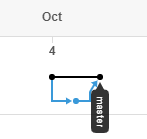
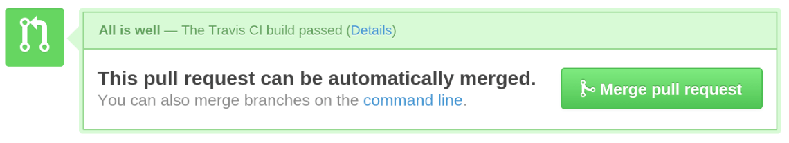

# Git Workflow

* [Feature Branch Workflow](#feature-branch-workflow)

## Feature Branch Workflow

This approach is used by Open Water Foundation when a single developer is primarily
working on any given project. In this case there may be a couple contributors with
write permission to the repository, but one developer is doing most of the work.

When using the feature branch workflow it is easy to keep track of exactly what code
is being added or removed from the overall project. These edits are made in small,
concise, feature branches.

All development that takes place is done in feature branches and never in master.
This way master will never have any broken code.

#### How it works: ####

A feature branch workflow is intended to keep development from being done directly
on the master branch, so each edit done to the code happens in it's own separate branch.
Best practice is to first create an issue on GitHub that describes what feature is
being added to the code.

<p align="center">
  
</p>

Next, you can now create a feature branch from the `master` branch (sometimes referred
to as a "topic" branch), using the issue number and label that you have just created.
Before making the new branch, ensure that you are currently on the `master` branch
and that `master` is up to date with any recent changes.

```
$ git checkout master
$ git pull
```

Now create the feature branch:  
`checkout` switches to a new branch, `-b` creates
the new branch to switch to, if the given branch name does not already exist.

```
$git checkout -b 1-update-readme
```

<p align="center">

</p>

Once in the new feature branch, edit, stage, and commit changes to this branch in
exactly the same manner as editing code on `master`.

```
$ git status
$ git add README.md
$ git commit -m "updated README.md"
```

After testing edits made to the project to insure no issues have been created,
it is safe to merge `1-update-readme` with `master`. (In a larger team of developers
it would be best to have someone confirm that any changes made, perhaps with pull
requests which is covered in other sections.) Switch back to `master`, ensure that
`master` is up to date, and merge `1-update-readme` with `master` branch.

```
$ git checkout master
$ git pull
$ git merge --no-ff 1-update-readme
$ git push
```

<p align="center">

</p>

By default git will try to merge a branch using **fast-forward** mode. It is best
practice to use **no-fast-forward** using `--no-ff`. See [below](#fast-forward) for more information
on **fast-forward** versus **no-fast-forward**.

## Fast-Forward

#### Feature Branches: ####

By default git will try to merge a branch using **fast-forward** mode.
```
$ git merge feature-branch
```

When **fast-forward** is applied to a merge, git will merge the commits in a linear
fashion. When looking at the network diagram in the repository "Insights" the
history will look like the diagram on the right below.

To force git to merge with no fast forward use the parameter `--no-ff`:

```
$ git merge --no-ff feature-branch
```

With **no-fast-forward** being used, git will maintain the feature branch in the
history and create a new commit on `master` representing the merge with that
feature branch. This can is seen represented by the diagram on the left below.

<p align="center">
  
</p>

#### Pull Requests: ####

When working with pull requests on GitHub's web interface via the green
"Merge pull request" button, the default behavior is to use no fast-forward.

<p align="center">
  
</p>

GitHub behaves this way to ensure that pull requests can be identified later on.
However, it is possible to merge a pull request with fast forward for pull requests
with squashed or rebased commits.
